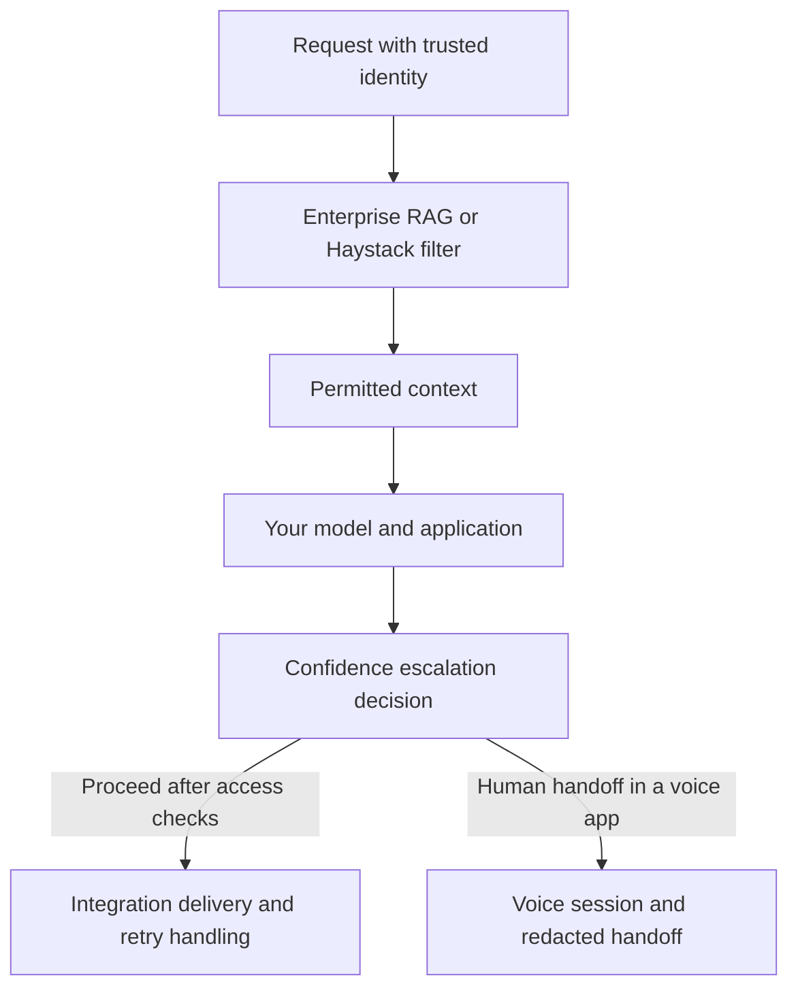

# Choose a project and get started

These Python libraries address different parts of an AI application: selecting
permitted documents, deciding when to escalate, handling voice transfers, and
delivering events reliably. You can use one library independently; you do not
need to adopt the whole collection.

## Which package fits your problem?

| Your problem | Start here | Verified release |
|---|---|---|
| A retrieval-augmented generation (RAG) application must keep unauthorized documents out of model context | [enterprise-rag-patterns](https://github.com/ashutoshrana/enterprise-rag-patterns) | [0.47.1 on PyPI](https://pypi.org/project/enterprise-rag-patterns/0.47.1/) |
| A Haystack pipeline needs an identity-scoped document filter | [haystack-ferpa-filter](https://github.com/ashutoshrana/haystack-ferpa-filter), installed as `ferpa-haystack` | [0.3.1 on PyPI](https://pypi.org/project/ferpa-haystack/0.3.1/) |
| An agent needs to withhold an action or escalate when its available confidence signals are insufficient | [confidence-escalation](https://github.com/ashutoshrana/confidence-escalation) | [0.3.0 on PyPI](https://pypi.org/project/confidence-escalation/0.3.0/) |
| A voice application needs to preserve session context and redact a handoff to a human | [voice-ai-governance](https://github.com/ashutoshrana/voice-ai-governance) | [0.3.1 on PyPI](https://pypi.org/project/voice-ai-governance/0.3.1/) |
| Events, webhooks, or tool-driven operations need retry handling and durable delivery | [integration-automation-patterns](https://github.com/ashutoshrana/integration-automation-patterns) | [0.44.1 on PyPI](https://pypi.org/project/integration-automation-patterns/0.44.1/) |

These versions were verified during the September 2026 release work. For newer
releases, check the package's PyPI page and changelog together. The [validation
report](RELIABILITY_VALIDATION.md) records the tested revisions and limits.

## Install the package you choose

Python 3.10 or newer meets the declared Python requirement of all five packages.
Create an isolated environment, then run the installation command for your choice:

```bash
python -m venv .venv
# macOS/Linux:
source .venv/bin/activate
# Windows PowerShell instead: .venv\Scripts\Activate.ps1
```

| Package | Reproduce the verified release |
|---|---|
| Enterprise RAG | `python -m pip install enterprise-rag-patterns==0.47.1` |
| Haystack filter | `python -m pip install ferpa-haystack==0.3.1` |
| Confidence escalation | `python -m pip install confidence-escalation==0.3.0` |
| Voice governance | `python -m pip install voice-ai-governance==0.3.1` |
| Integration patterns | `python -m pip install integration-automation-patterns==0.44.1` |

Follow the selected README for optional framework or Redis dependencies. Installing
a library does not configure your model provider, database, phone service, or
application's authorization rules.

## What each library does

### Enterprise RAG patterns

For developers building question-answering or agent workflows over access-controlled
documents. The library uses the requester's identity and document metadata to
decide which retrieved content may proceed toward the model, with audit hooks and
framework adapters.

**Example use:** a support assistant should receive only records belonging to the
requester's authorized institution and category. Your application supplies trusted
identity context and correctly classified document metadata; the library enforces
the configured retrieval boundary. Missing metadata and an explicitly public
document are different cases.

Start with the [README and quick start](https://github.com/ashutoshrana/enterprise-rag-patterns/blob/main/README.md),
then explore the [examples](https://github.com/ashutoshrana/enterprise-rag-patterns/tree/main/examples)
and [documentation](https://github.com/ashutoshrana/enterprise-rag-patterns/tree/main/docs).

### FERPA filter for Haystack

For developers already using Haystack who want a pipeline component focused on
filtering documents by configured identity and scope. It accepts Haystack documents
and returns the subset permitted by the metadata rules. Check the component's
metadata contract before connecting a document store.

**Example use:** filter retrieved institutional documents before passing them to a
prompt builder. Choose this component for a focused Haystack integration; choose
enterprise-rag-patterns when you need its broader collection of retrieval patterns
and adapters. You do not need both for every pipeline.

The maintained source is **[haystack-ferpa-filter](https://github.com/ashutoshrana/haystack-ferpa-filter)**.
The PyPI distribution is **`ferpa-haystack`**. The similarly named
`ashutoshrana/ferpa-haystack` repository is legacy source, not the current publisher.
Read the [component setup, metadata requirements, and examples](https://github.com/ashutoshrana/haystack-ferpa-filter/blob/main/README.md).

### Confidence escalation

For agent developers who need an explicit rule for allowing, restricting, or
escalating a proposed operation based on available confidence signals. The package
combines signals with threshold policies and escalation handlers; it includes
synchronous and asynchronous pre-action guards and framework adapters.

**Example use:** pause a proposed account update when the available evidence does
not meet your policy, and request human review. Use a pre-action guard when the
operation must not run before the decision. Evaluating an answer after it has been
generated cannot undo a tool call that already happened.

A confidence score is not an authorization grant or a calibrated probability by
default. Supply independent access checks and choose thresholds using representative
labeled cases. Start with [scoring, policies, and integration examples](https://github.com/ashutoshrana/confidence-escalation/blob/main/README.md).

### Voice governance

For developers connecting a voice agent to a human handoff or managing its session
state. The package provides handoff-state handling, PII scrubbing, and integrations
for supported voice frameworks. Session context is input to a redacted handoff;
your voice platform still performs the actual call routing.

**Example use:** transfer a caller with their current intent and a scrubbed summary
so the next person has context. Select the documented Redis support when state must
be coordinated across processes. Test redaction against your own field names,
payloads, and language: rule-based scrubbing cannot detect every possible secret or
personal identifier.

Start with [session management, warm-transfer examples, and framework setup](https://github.com/ashutoshrana/voice-ai-governance/blob/main/README.md).

### Integration automation patterns

For developers moving events between applications or connecting agent tools to
business workflows. The repository includes examples of idempotency, retries,
sagas, transactional outboxes, webhook validation, and authenticated MCP tools.
Pick the pattern that matches your failure case rather than adding every pattern.

**Example use:** persist an event and retry delivery after a worker stops. The
SQLite outbox example can deduplicate business effects committed through the same
database transaction. It does not guarantee exactly-once effects in an external
CRM, payment API, or other independent service; those need their own idempotency
and recovery design.

Start with the [quick start and pattern catalog](https://github.com/ashutoshrana/integration-automation-patterns/blob/main/README.md),
then use the [examples](https://github.com/ashutoshrana/integration-automation-patterns/tree/main/examples)
and [combined workflow walkthrough](https://github.com/ashutoshrana/integration-automation-patterns/blob/main/docs/GOVERNED_SERVICE_DEMO.md).

## How they can work together

This is an example composition, not a required architecture. The model and your
application's authentication and authorization remain separate components.



For dedicated pre-action policy enforcement and audit handling, the related
[regulated-ai-governance](https://github.com/ashutoshrana/regulated-ai-governance)
library addresses that additional boundary. Confidence scoring does not replace it.

The [combined demo](https://github.com/ashutoshrana/integration-automation-patterns/blob/main/docs/GOVERNED_SERVICE_DEMO.md)
uses synthetic requests, a recording model stand-in, approval/revocation checks,
crash/replay recovery, and a scrubbed handoff. Read its setup and limits before
adapting it. It is reproducible integration evidence, not a live deployment.

## Where to go next

1. Choose one package and run its documented quick start with synthetic data.
2. Read the example nearest your use case and its corresponding tests.
3. Check the [validation report](RELIABILITY_VALIDATION.md) for what was tested,
   including framework versions and release-versus-source differences.
4. Use the chosen repository's Issues page for a reproducible bug report or a
   specific integration request. Remove credentials and personal data first.

These are implementation libraries, not hosted services or compliance
certifications. Regulatory names identify intended application areas; applicability
and deployed behavior require review in the system where you use them.
